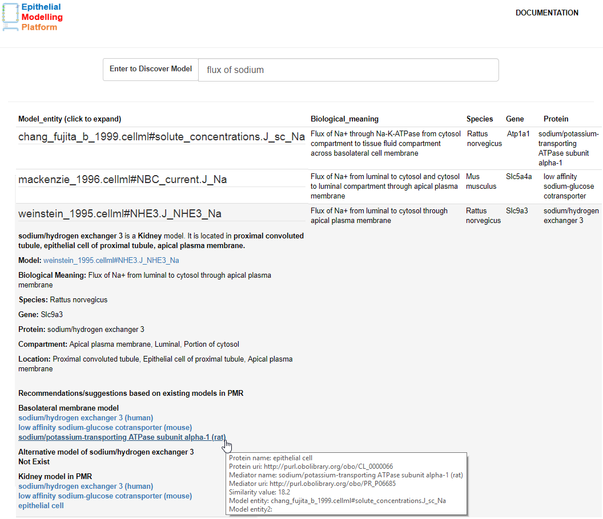

# Model discovery with the Physiome Model Repository

Model discovery tool is a web-based epithelial transport discovery, exploration and recommendation tool. It allows users to discover, explore and recommend CellML models of interest. This tool is deployed at this address: http://model-discovery-tool.nectar.auckland.ac.nz; as a demonstration of the capabilities described is the paper: LINK TO PREPRINT HERE?.

## Installing MDT

This tool makes use of webservices provided by [PMR](https://models.physiomeproject.org) as well as several services from the [European Bioinformatics Institute (EBI)](https://www.ebi.ac.uk/services). In oder to develop web applications which make use of services in this way, it is best to make use of a reverse proxy to ensure the web application plays nicely with modern web browsers. In this project, we use a Docker-based [NGINX](http://nginx.org/) reverse proxy for this purpose, which makes it reasonably easy to get this demonstration up and running locally as well as deploying it on various cloud platforms.

If you have Docker and git installed on your machine, then the following should get you up and running:
```
git clone https://github.com/dewancse/model-discovery-tool
docker build -f Dockerfile -t unique-name/mdt-nginx .
docker run -p 49160:8181 -d unique-name/mdt-nginx
```
And then http://localhost:49160 should work.

## MDT workflow

### Discover relevant entities

The first step is to discover entities in PMR relevant to your interests. The discovered entities are typically components or variables in CellML models, but as the annotated content on PMR continues to grow the pool of potentially relevant entities similarly grows. With our current focus on epithelial transport in the kidney, this demonstration is tuned toward the kinds of entities most commonly found in models of such systems - e.g., fluxes of solutes typically found in renal epithelial cells (sodium, potassium, ammonium...) and processes occuring in, or between, the lumen, cytosol, and interstitial compartments.

Presented in the screenshot below is an example of discovered entities from PMR for the entered text `flux of sodium`. From these results, the user can access further information on each discovered entity to help them determine which may be most relevant to their work. The additional information usually consists of the name of the model, component name and variable name; associated biological information about the entity deposited in PMR; protein names; and species and genes used during the experiments.


*A screenshot illustrating an example MDT session, where the user has queried for any entities relevant to the text "flux of sodium".*

### Input handling

We would like users to be able to enter the "plain text" description of what they are interested in, but currently the entered text needs to be converted to one or more semantic queries executed against the PMR knowledgebase. In the future, we are looking to integrate tools such as Natural Language Processing to automate this conversion. Currently we define a dictionary of common phrases that the potential users of renal epithelial cell models might be interested in and use that to map the entered text to the semantic queries. Therefore, mapping follows the *exact match* principle. It is case insenstitive and users have to include the following terms when searching for a model:

| Physical entity | Physical process | Solutes |
| --- | --- | --- |
| `concentration` | `flux` | sodium, hydrogen, chloride, potassium, ammonium |

### Recommender System

As part of the additional information available for the discovered entities, a recommender system has been implemented to present the user with additional entities in PMR that may be of interest. As with the rest of this tool, the recommender system is currently very renal epithelial transport focussed, but the implementation will be easily extendable to a wider range of physiology as the available semantic knowledge in PMR grows.

As shown in the screenshot displayed above, the additional information for an entity is displayed when the user selects a discovered entity. This system will appear as a collapsible window when the user will click a model across the apical or basolateral membrane. Presented above is an example of a CellML model entity - `flux of sodium` in the Weinstein model after clicking the Weinstein model. Initially this system gives a brief description of the clicked model followed by some suggestions from the annotation in PMR. By using this system the user will get existing transporters located in the basolateral membrane which transport the sodium solute. Also, alternative models of this model from various workspaces, and related kidney models have been provided for further exploration. User can choose one of the models from this system as a replacement of the clicked model.

## Docker Image in Nectar Cloud
We have deployed our Docker image to Nectar Cloud. In order to begin with the deployment process, please navigate to [Dashboard](https://dashboard.rc.nectar.org.au/auth/login/) in Nectar Cloud and provide login credentials. As a student at the University of Auckland, I have provided my login credentials, as illustrated below. Following screenshots are examples of our Docker image's deployment to Nectar. Please read texts below of each screenshot to know in details.  

 

*A login screen, where the user will choose either NZ or Australian.*


*A screenshot illustrating my federation and organization details.*


*An example Docker setup session, where the user will click "Quick Deploy" to begin with a session.*


*Fill out an application name, a docker image name from the Docker registry, and a port number for the docker container. Then click "Add Application".*


*Enter an application name and the remaining fields are optional. Then click "Next".*


*Choose the Ubuntu instance name from the dropdown menu, along with your key pair and availability zone. Follow this [key pair](https://support.ehelp.edu.au/support/solutions/articles/6000055376-launching-virtual-machines#Keypair) document to create a key pair, which will appear here under the key pair dropdown menu. Then click "Create".*


*Click "Create" to setup an environment for the Docker container.*


*Then click "Deploy This Environment" to begin with a deployment session.*


*Lastly, navigate to the IP address with the port number mentioned in the screenshot to visit the up and running docker image. Note that the user can apply for a DNS host name for this IP address to Nectar support team [Ask For Help](https://support.ehelp.edu.au/support/home).*

## Accessibility
The application is accessible by navigating::
```
  http://model-discovery-tool.nectar.auckland.ac.nz or http://130.216.216.164
```

## Programming Language
- JavaScript
- SPARQL

## Limitations
We will implement Unit testing and Functional testing to make sure the code is functioning as expected. While the underlying tools are not specific to renal epithelial transport, the currently supported text-to-query mappings and recommender system are very specific to renal epithelial transport.

### List of contributors
- Dewan Sarwar - @dewancse
- David Nickerson - @nickerso

### Licencing
MIT license!

### Acknowledgements
This project is supported by the MedTech Centre of Research Excellence (MedTech CoRE), the Aotearoa Foundation, and the Auckland Bioengineering Institute.
